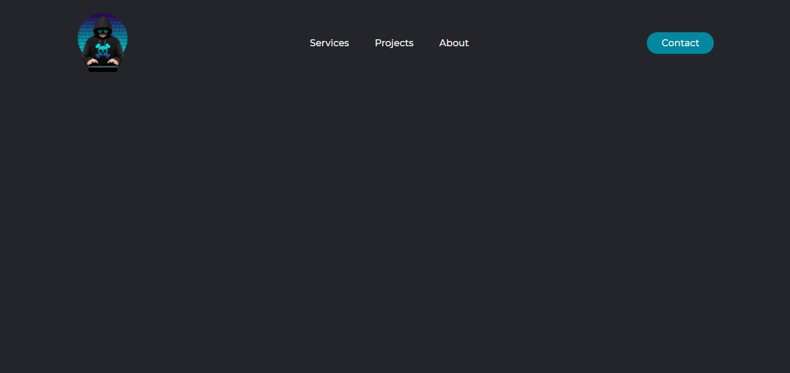

# Modelos de Navbar



## Executar Projeto:

```
git clone https://github.com/Felipendev/NavbarExemplos.git
```

- > Navegue pelo gerenciador de arquivos até a pasta NavbarExemplos

- > Abra o modelo desejado e clique duas vezes no arquivo index.html

# English
## Run Project:

```
git clone https://github.com/Felipendev/NavbarExemplos.git
```

- > Navigate through the file manager to the NavbarExemplos folder

- > Double-click the index.html file